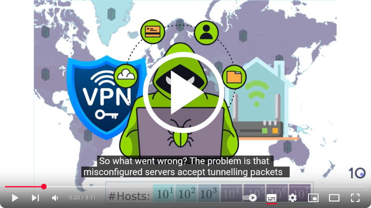
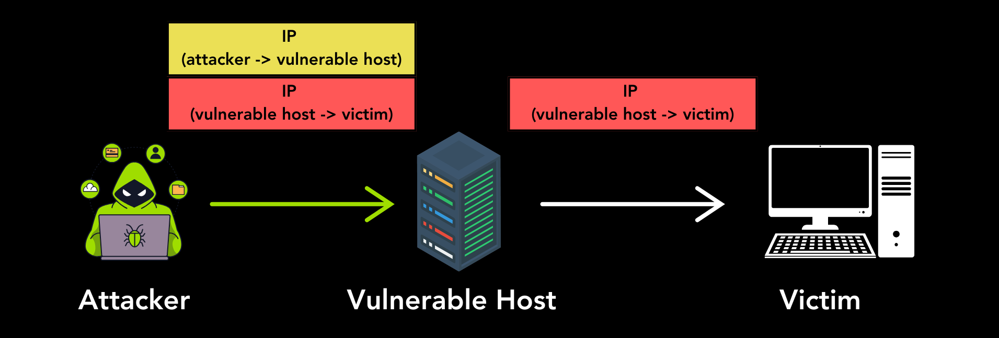

# Haunted by Legacy: Discovering and Exploiting Vulnerable Tunnelling Hosts

## [1. Introduction](#id-intro)

In our [USENIX Security '25 paper](https://papers.mathyvanhoef.com/usenix2025-tunnels.pdf) we identified over 4 million vulnerable Internet servers that can be abused to attack any website or service on the Internet. These vulnerable servers, called tunneling hosts, are misconfigured and will wrongly forward any received Internet traffic to an attacker-chosen destination. A malicious individual can abuse this to hide their identity while attacking any website or service on the Internet: malicious traffic received by the victim will appear to be sent by the vulnerable tunneling host, effectively hiding the attacker's identity. More problematic, an attacker can also exploit these vulnerable tunneling hosts to spoof their IP address, making it look like their traffic is coming from somewhere else entirely. This ability is similar to sending a letter with a fake return address, which enables a malicious individual to perform anonymous Internet attacks.

We scanned the full Internet using 7 different methods to study the prevalence of vulnerable tunnelling hosts. In total, this revealed more than 4 million vulnerable tunneling hosts. We also investigated where these vulnerable hosts are located. This indicated that various organizations contained vulnerable hosts, most notably this included the Content Delivery Network of Facebook and Tencent’s cloud services. Additionally, the home routers of the French Free ISP were also vulnerable and a sizable number of vulnerable hosts were associated with the Belgian Telenet ISP. These organizations have meanwhile been contacted and rectified the issue. Telenet indicated that it was their customers that were affected.

You can watch a 3-minute video where our findings are visually explained on [YouTube](https://youtu.be/eFZsM3khrSk?t=8):

The [corresponding research paper](https://papers.mathyvanhoef.com/usenix2025-tunnels.pdf) will be presented at the [USENIX Security '25 conference](https://www.usenix.org/conference/usenixsecurity25). In our paper, we also explain and demonstrate new Denial-of-Service (DoS) attacks that exploit these vulnerable hosts. These kinds of attacks overwhelm a target with malicious traffic, causing the website or Internet service to no longer be responsive. Our first novel DoS attack, called the "Ping-Pong" attack, involves overwhelming a target by looping packets between vulnerable tunneling hosts to amplify traffic. The second attack, called Tunnelled-Temporal Lensing (TuTL), concentrates traffic in time, causing a surge of traffic to arrive at the victim all at once. Finally, the researchers found that the vulnerable hosts can be used for Economic Denial of Sustainability (EDoS) attacks by forcing the hosts to consume large amounts of bandwidth, thereby incurring unexpected financial costs to the victim.

Furthermore, there are indications that the vulnerable hosts may also be abused to access to an organization’s private network, potentially revealing sensitive information. This is because normally the vulnerable tunneling hosts are used to link two physically seperate networks. Unfortunately, many of these tunneling protocols do not contain protections such as authentication or encryption, which is a core root cause of why these vulnerable hosts can be discovered and subsequently exploited by a malicious individual.

For further information, feel freel to also listen to our [17-minute generated podcast](https://people.cs.kuleuven.be/~mathy.vanhoef/tunneling/podcast.mp3) that explains our findings in a fun and relatable manner:

To mitigate the vulnerability, several defences exist, including filtering traffic based on trusted sources, utilising deep packet inspection, and implementing source address filtering. We hope our results will motivate and guide administrators to secure tunnelling hosts better.

## [2. Overview of Resources](#id-resources)

This repository will contain scripts to test whether hosts/servers accept unauthenticated tunneling packets. In particular, it can test whether a host accepts IPIP, IP6IP6, GRE, GRE6, 4in6, and 6in4 packets using various scanning methods. A high-level description of the resulting attacks can be found below, and a detailed description and evaluation of all attacks can be found in our [USENIX Security '25 paper](https://papers.mathyvanhoef.com/usenix2025-tunnels.pdf). Additional information can also be found at the following websites:

* [Article by Top10vpn](https://www.top10vpn.com/research/tunneling-protocol-vulnerability/) that summarises our findings **with extra details on affected VPN servers**.
* [Results of daily Shadowserver scans](https://dashboard.shadowserver.org/statistics/combined/map/?map_type=std&day=2025-01-14&source=ip_tunnel&source=ip_tunnel6&geo=all&data_set=count&scale=log): we collaborated with the Shadowserver Foundation to perform daily scans for vulnerable tunneling hosts. If you possess your own IP ranges, you can register with Shadowserver to get notifications of vulnerable hosts. Note that Shadowserver is not yet using all the scan methods that we employed during our own research, those will still be added later. Also see their [historical graph](https://dashboard.shadowserver.org/statistics/combined/time-series/?date_range=30&source=ip_tunnel&source=ip_tunnel6&dataset=unique_ips&group_by=tag&style=overlap).
* [Haunted by Legacy: Discovering and Exploiting Vulnerable Tunnelling Hosts](https://papers.mathyvanhoef.com/usenix2025-tunnels.pdf): our academic USENIX Security '25 paper that describes the findings in detail.
* [Vulnerability Note VU#199397: Insecure Implementation of Tunneling Protocols (GRE/IPIP/4in6/6in4)](https://kb.cert.org/vuls/id/199397). See also the assigned [CVE identifiers described below](#id-summary-cves).
* [Youtube Video](https://youtu.be/eFZsM3khrSk?t=8): explanation and illustrations of the findings.
* [Postcast (17:27)](http://people.cs.kuleuven.be/~mathy.vanhoef/tunneling/podcast.mp3): this auto-generated podcast was manually edited by removing some unrelated information on defences.

**NOTE: To prevent abuse, this scanning script is not yet publicly available. Only the README of the script is available. Please contact us to get access to the actual scanning scripts. We can also provide Z-Map modules to scan multiple hosts at once.**

## [2.1 Shadowserver Scans](#id-shadowserver)

Shadowserver does not use all our scanning methods. Instead, they focus on the most unintrusive and best-performing scan types. The scan types they use are:

| Protocol  | Scan name in paper | Z-Map module name |
| ------------- | ------------- |  ------------- |
| ipip	| Standard	| ipip |
| gre	| Standard	| gre |
| ip6ip6 | 	Standard	| ip6ip6 |	
| gre6	| Standard	| gre6 |
| 4in6	| TTL Expired	| 4in6_ttl |
| 6in4	| 6to4 src	| 6in4_6to4 |

## [3. Technical Details](#id-summary)

We found that many Internet hosts accept unauthenticated [IPIP](https://datatracker.ietf.org/doc/html/rfc2003), [IP6IP6](https://datatracker.ietf.org/doc/html/rfc2473), [GRE](https://datatracker.ietf.org/doc/rfc2784/), [6in4](https://datatracker.ietf.org/doc/html/rfc4213), or [4in6](https://datatracker.ietf.org/doc/html/rfc2473) tunneling packets from an arbitrary source. This means an adversary can send a tunneling packet to such vulnerable hosts, and the vulnerable host will process the encapsulated inner packet, without authenticating (the source of) the tunneling packet. An adversary can abuse this to perform Denail-of-Service attacks, to spoof their source IP address, and possibly to gain access to an organization's private or local network.

An example attack, written using the [Python Scapy](https://scapy.net/) library, is:

	from scapy.all import *
	inner_packet = IP(src="1.1.1.1", dst="8.8.8.8")/ICMP()
	vulnerable_host = "1.0.0.1"
	send(IP(dst=vulnerable_host)/GRE()/inner_packet)

The vulnerable host at `1.0.0.1` will receive the IP/GRE packet and then process and forward the inner IP packet to its destination. More worrisome, many vulnerable hosts will perform no sanity checks on the inner packet. This means many vulnerable hosts can be abused to spoof the source IP addresses of packets. As shown in the above example, the forwarded packet can have the IP address `1.1.1.1`, even though the real IP address of the vulnerable host is `1.0.0.1`. This means an ICMP packet will be sent to `8.8.8.8` with as spoofed source address `1.1.1.1`. Similar attacks are possible against IPv4 and IPv6 hosts using the protocols [IPIP](https://datatracker.ietf.org/doc/html/rfc2003), [IP6IP](https://datatracker.ietf.org/doc/html/rfc2473), [GRE6](https://datatracker.ietf.org/doc/rfc2784/), [6in4](https://datatracker.ietf.org/doc/html/rfc4213), or [4in6](https://datatracker.ietf.org/doc/html/rfc2473). Note that we use 'host' as a synonym for an IPv4 or IPv6 address and that we will use 'GRE6' when GRE packets are sent between IPv6 hosts.

### [3.1 Scanning Methods](#id-summary-scans)

To detect vulnerable hosts, we scanned the IPv4 and IPv6 Internet using three main methods. These methods are further explained in the indicated sections of our paper:

- **Standard Scan** (Section 3.2.1): In this scan, the inner packet is an ICMP ping reply with as source IP address the vulnerable host and as destination our scanning server. We also did a subnet spoofing variant of this scan, where the inner packet has as source an IP address within the same subnet as the host. Additionally, we did a spoofing variant, where the inner packet has a spoofed source IP address that is outside the subnet of the host.

- **ICMP Echo/Reply (Ping) Scan** (Section 3.2.2): In this scan, the inner packet is an ICMP ping request with as destination the vulnerable host itself and as source address our scanning server. In case the host is vulnerable, it will process the ping request, and send a ping reply to our scanning server.

- **Time Exceeded (TTL) Scan** (Section 3.2.3): In this scan, the inner packet is an IP packet with a Time-To-Live (TTL) equal to one, or an IPv6 packet with a Hop Limit equal to zero. This inner packet has as source address our scanning server, and has as destination address a random public IP address. If the host tries to forward this packet, and hence is vulnerable, it will generate an ICMPv4 or ICMPv6 Time Exceeded packet towards our scanning server.

For the 4in6 scans, where we send a tunneling packet to an IPv6 host with as inner packet an IPv4 packet, we cannot perform a ping scan because we do not know the IPv4 address of the IPv6 host being scanner. This also implies we can only do the spoofing variant of the standard scan, because we do not know the IPv4 subnet of the host.

For the 6in4 scans, where we send a tunneling packet to an IPv4 host with as inner packet an IPv6 packet, we can use the [IPv4-Mapped IPv6 Address](https://datatracker.ietf.org/doc/html/rfc4291#section-2.5.5.2) of the form `ffff:IPV4_ADDRESS_IN_HEX::` to perform the standard and ping scans.

### [3.2 Impact Summary](#id-summary-impact)

- **Denial-of-Service**: An attack that is always possible is a Denial-of-Service attack by recursively encapsulating tunneling packets and sending this constructed packet to a vulnerable host. The vulnerable host will then recursively keep processing the encapsulated tunneling packets until the last nested packet is reached. This implies that sending a single packet will result in substantial processing time on the vulnerable host. In terms of CPU usage on the vulnerable host, this can result in an amplification factor of 70x when performing a DoS attack, and even higher when combined with IP fragmentation. Depending on the behaviour of the vulnerable tunneling host, other DoS attacks may also be possible, such as a Tunneled-Temporal Lensing Attack or Economic DoS attack. See our draft paper for details.

- **Source Address Spoofing**: An adversary can abuse vulnerable tunneling hosts to spoof their source IP address. This is because the vulnerable tunneling host will forward IP packets on behalf of the attacker. A host can spoof source IP addresses when the Standard "subnet spoof" and "spoof" scans indicate that the server is vulnerable.

- **Internal Network Access**: In case the vulnerable host is connected to a private network, then the open tunneling host can possibly be abused to gain access to all devices within this connected private network. This may particularly be possible if the vulnerable hosts also implement Network Address Translation (NAT). The precise details of this are still being investigated.

### [3.3 Assigned CVE Identifiers](#id-summary-cves)

- [CVE-2020-10136](https://nvd.nist.gov/vuln/detail/CVE-2020-10136): IPv4-in-IPv4 (IPIP) protocol (RFC2003).
- [CVE-2024-7595](https://nvd.nist.gov/vuln/detail/CVE-2024-7595): GRE and GRE6 (RFC2784).
- [CVE-2024-7596](https://nvd.nist.gov/vuln/detail/CVE-2024-7596): Generic UDP Encapsulation (GUE) (IETF Draft). We did not detect any vulnerable hosts using this draft protocol.
- [CVE-2025-23018](https://nvd.nist.gov/vuln/detail/CVE-2025-23018): IPv4-in-IPv6 (4in6) and IPv6-in-IPv6 (IP6IP6) protocols (RFC2473).
- [CVE-2025-23019](https://nvd.nist.gov/vuln/detail/CVE-2025-23019): IPv6-in-IPv4 (6in4) protocol (RFC4213).

## [4. Tool Prerequisites](#id-prerequisites)

You can execute the following commands to initialize the Python environment to execute the script. We tested these commands on Ubuntu 24.04:

	python3 -m venv venv
	source venv/bin/activate
	pip install wheel scapy==2.6.1

You can then load this Python environment as root and execute the script:

	sudo su
	source venv/bin/activate
	./tunnel_tester.py

## [5. Steps to Reproduce](#id-reproduce)

After the prerequisite steps, you can execute the following command to test IPv4-capable hosts:

	./tunnel_tester.py eth0 -t 183.232.161.42

The parameters are:
* `-i eth0`: The interface that should be used to send and receive the packets. It must have an IPv4 address, otherwise, no tests are performed.
* `-t 183.232.161.42`: This is the IPv4 address of the host being tested.

You can test IPv6-capable hosts using the following command:

	./tunnel_tester.py eth0 -t6 2a00::1000

The parameters are:
* `-i eth0`: The interface that should be used to send and receive the packets. It must have an IPv6 address, otherwise, no tests are performed.
* `-t6 2a00::1001`: This is the IPv6 address of the host being tested.

The IPv4 and IPv6 tests can also be performed in a single execution:

	./tunnel_tester.py -t 183.232.161.42 -t6 2a00::1001

For each performed test, the script will output `SAFE` if no vulnerability was detected, and `VULNERABLE` if a vulnerability was detected. Note that we recommend executing the script multiple times, since sometimes replies may get lost. You can also increase or decrease how long the script waits for replies using the `--timeout` parameter. For instance, by specifying `--timeout 0.5` the script will only wait half a second for replies.

## [6. Advanced Usage](#id-advanced)

By default, the script will use the IP address associated to the given interface as the source address in transmitted packets. To use a different source address, or explicitly set the IP address in case it does not get detected properly, you can use:

* `-P A.A.A.A`: The IPv4 to use as source address in outgoing IP packets.
* `-P6 2a00::1000`: The IPv6 to use as source address in outgoing IP packets.

By default, the script will try to spoof IP addresses belonging to KU Leuven University in the standard spoof scan. To try to spoof a different source IP address you can use the following arguments:

* `-s 212.224.129.90`: Test whether the vulnerable host has the ability to spoof the given source IPv4 addresses.
* `-s6 2a02:2c40:0:80::80:15`: Test whether the vulnerable host has the ability to spoof the given source IPv6 addresses.

In the Time Expired TTL scans, the inner IP addresses by default belong to KU Leuven University. To use a different inner destination IP address, in order to trigger packet forward and generate the TTL Expired error, you can use the following arguments:

* `-t 212.224.129.90`: Test whether the vulnerable host has the ability to spoof the given source IPv4 addresses.
* `-t6 2a02:2c40:0:80::80:15`: Test whether the vulnerable host has the ability to spoof the given source IPv6 addresses.

When running the script on an AWS EC2 server, you need to explicitly provide the private and public IP address of the server using the following arguments:

* `-p 172.0.0.1`: The private IPv4 address of the scanning server.
* `-P 1.2.3.4`: The public IPv4 address of the scanning server.

## [7. Troubleshooting](#id-troubleshooting)

- Ensure you are injecting packets on the correct interface!

- When you are testing your own vulnerable server, ensure that the `accept_local` and `ip_forwarding` sysctls for both IPv4/6 are set. Otherwise, the host may not be vulnerable to (all) attacks.

- With tcpdump you can use the filter `"proto 4 or proto gre or proto 41"` to capture the packets that the scanning tool is transmitting (this will not show possible replies).

- When you are testing whether open tunneling hosts also forward non-ICMP traffic, remember that the inner packet must have an IP packet. So in Python/Scapy you have to construct a packet of the form IP()/GRE()/IP()/UDP(). In the past, some have forgotten the inner IP header when testing this.

## [Acknowledgements](#id-acknowledgements)

To investigate the properties of the vulnerable hosts during the research and disclosure, we made use of the [Censys Dataset](https://docs.censys.com/docs/research-access-to-censys-data#/). See their paper [A Search Engine Backed by Internet-Wide Scanning](https://dl.acm.org/doi/10.1145/2810103.2813703) by *Zakir Durumeric, David Adrian, Ariana Mirian, Michael Bailey, J. Alex Halderman* published at ACM CCS '15.
